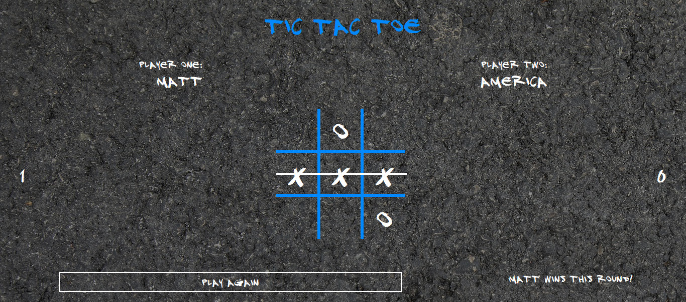

# Readme
# Blacktop Tic Tac Toe

## Overview

Tic Tac Toe like back when you played it on your driveway!  For two players.

### Challenge

The app was required to basically have as little global code as possible, 
which would be accomplished by "tucking everything away inside of a module or 
a factory".  The gameboard logic was to be built separate from the DOM interactions
themselves.  The full requirements from the Odin Project curriculum [here](https://www.theodinproject.com/paths/full-stack-javascript/courses/javascript/lessons/tic-tac-toe).  

### Screenshot

  

### Links

- [Live site](https://mattdimicelli.github.io/tic-tac-toe/)
- [Repo](https://github.com/mattdimicelli/tic-tac-toe)

## My process

### Built with
- Vanilla JS, CSS, and HTML
- Modularization via "Factory function" modules and IIFEs
- Responsive design for mobile to desktop size viewports via Flexbox and media
  queries
- Webfonts
- Canvas API

### What I learned

I'm writing this readme retrospectively, seven months after I coded the project,
but I believe that the main learning point for me was about how to think about
and structure code in terms of OOP, using objects.  At the time I was learning
about the *many* different types of modules, and the main take-away for this 
project was that I could use the "factory functions" for things that I needed
multiples of (for example, players) and IIFEs for things that I only needed one 
of (such as a gameboard... you only need one board to play Tic Tac Toe).

It was also my first time working with the Canvas API.  It was eye-opening to 
see the advanced APIs that are baked into modern HTML.  

